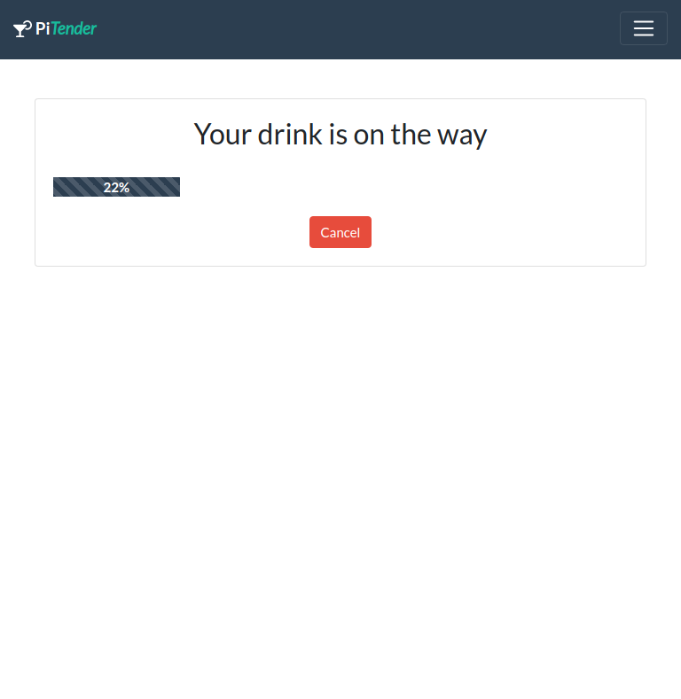
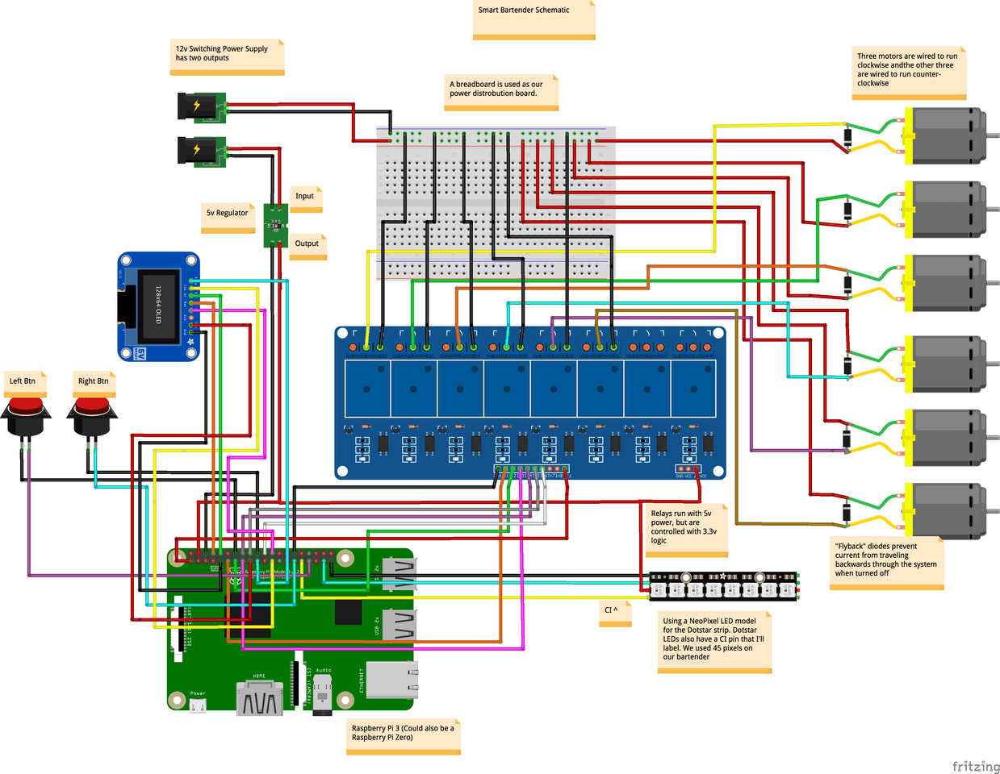
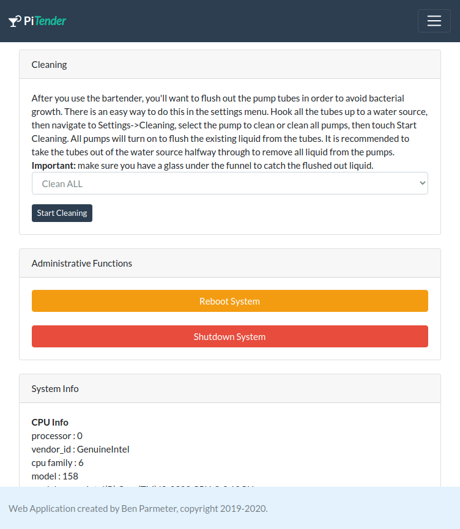
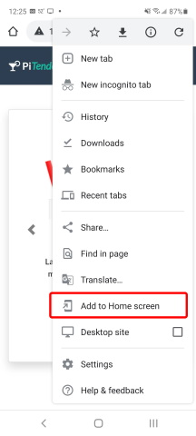
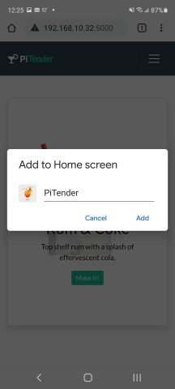

#  PiTender

### Raspberry Pi based Automatic Bartender using Python and Flask/Gunicorn/nginx
##### Also uses Bootstrap 4 (http://getbootstrap.com/) w/jQuery

***Note:*** *This project is continuously evolving, and thus this readme will likely be improved over time, as I find the inspiration to make adjustments.  That being said, I'm sure there will be many errors that I have overlooked or sections that I haven't updated.*

This project was inspired by the Hacker Shack and their excellent smart bartender project (https://www.hackster.io/hackershack/smart-bartender-5c430e).  I encourage you to check it out and get a rough idea of how this all works.

This version of the bartender script is a complete re-write using a flask web interface, such that we can use a smart phone, computer, or tablet to control your bartender.  I've removed the OLED screen and manual buttons, and have only left the relays and pumps (and have added a couple more pumps if you so desire).  

I'm using Gunicorn and nginx to proxy web requests.  This is simple enough to configure and setup, however I had to redesign the application without the threading libraries, due to conflicts with Gunicorn.  Instead, I am using two processes running concurrently (control.py and app.py).  Control handles all of the RasPi GPIO interfaces, while App handles the web routes.  They communicate through a series of json files.  

## Update 2020/12

Happy Holidays!  Well, it's time for a little bit of an overhaul of this project.  Here are some of the changes that are part of this update:
* Using Python 3.x in this version, given that python 2.x is being depricated in the future
* Redesign of the hardware interface in control.py using loadable modules such that you can swap out different SBCs, or test on a PC
* Redesign of the web UI to use Flask extending base templates
* Added a Recipe Builder to the web UI so that you can add ingredients and create new recipes/drinks from those ingredients 
* Added some new drink images and moved to `/static/img/drinks/` (note that if you want to add new images, you can simply put them here)

**Note:** This project hasn't been fully tested on real working hardware and your mileage may vary.  Please do submit issues here if you find any and I will try to get to it when I can.  

## Screenshots

Here is a screenshot of the dashboard:


Screenshot of the PiTender working: 



Here is a screenshot of the recipe builder:


Screenshot of the ingredients editor: 


Here is a screenshot of the settings screen:


## Hardware Configuration

### The Parts List
The parts list and setup of this was heavily borrowed from the following guide here:
(https://www.hackster.io/hackershack/smart-bartender-5c430e)

* **Raspberry Pi Zero W** - Technically any Raspberry Pi (greater than Pi2) will do fine, but for this application a Raspberry Pi Zero W works really well and is the right price.
* **8-Channel Relay** - Used to run the pumps. [Amazon Link](https://www.amazon.com/dp/B0057OC5WK/ref=cm_sw_em_r_mt_dp_U_TktNCbPC5MVRB)
* **Diodes** - (Same number as the number of pumps) - 1N4007 - High Voltage, High Current Rated Diode
* **Pumps** - (8 Recommended) - 12V DC Peristaltic Dosing Pump - https://www.amazon.com/gp/product/B01IUVHB8E/ref=as_li_tl?ie=UTF8&camp=1789&creative=9325&creativeASIN=B01IUVHB8E&linkCode=as2&tag=hackerhouse-20&linkId=042cb752e964390bfb72864185928b64
* **Micro SD Card** - Greater than 4GB is probably good.  
* **MicroUSB Power Adapter** - At least 1 amp current recommended.  
* **Power Supply** - AC-DC Voltage Converter, AC 110-220V to DC 12V 10.5V-13.5V Module 100W 8.5A Volt Regulator Switching Power Supply Board with Aluminum Shell Case - https://www.amazon.com/gp/product/B075R7ZVMH/ref=as_li_tl?ie=UTF8&camp=1789&creative=9325&creativeASIN=B075R7ZVMH&linkCode=as2&tag=hackerhouse-20&linkId=6d3910ad8b7f6aca716ce19e647a87c0
* **DC/DC Converter** - DCDC Converter, DROK Step Down Voltage Regulator Module DC 4.5-40V 36V 24V to 1.25-37V 12V 9V 5V 3V Variable Buck Converter Adjustable Electronic Power Supply Volt Reducer Transformer Stabilizer Board - https://www.amazon.com/gp/product/B00SY37S00/ref=as_li_tl?ie=UTF8&camp=1789&creative=9325&creativeASIN=B00SY37S00&linkCode=as2&tag=hackerhouse-20&linkId=0b264583326bc6dc626ef243783fba6a

### Hardware Setup

Below is the schematic borrowed from the [Hackster.io](https://www.hackster.io/hackershack/smart-bartender-5c430e) site.  This is the same basic design that we will be using for the PiTender project, however the display, the LED strip and the buttons are removed from this design.  

Instead of these, we will use a Web based user interface that can be used via a local display (attached to the Raspberry Pi), a tablet, smartphone or PC with a web browser.  



### Raspberry Pi GPIO Mapping

__Relay Control (defined in settings.json):__
* **GPIOx Relays (1-8)** - Controls pump_01 - pump_08

Should be configured from the WebUI (Settings Screen).  You can easily select what pumps are connected to GPIO pins, thus there isn't really a need to lock down specific GPIO's for the project.  Use what is most convenient for you, or follow the Hackster.io implementation. 

## Software Installation

### Raspberry Pi Zero Setup Headless (*from raspberrypi.org*)

Once you've burned/etched the Raspberry Pi OS image onto the microSD card, connect the card to your working PC and you'll see the card being mounted as "boot". Inside this "boot" directory, you need to make 2 new files. You can create the files using a text editor of your choice.

+ Step 1: Create an empty file. You can use Notepad on Windows or TextEdit to do so by creating a new file. Just name the file **ssh**. Save that empty file and dump it into boot partition (microSD).

+ Step 2: Create another file name wpa_supplicant.conf . This time you need to write a few lines of text for this file. For this file, you need to use the FULL VERSION of wpa_supplicant.conf. Meaning you must have the 3 lines of data namely country, ctrl_interface and update_config

```
country=US
ctrl_interface=DIR=/var/run/wpa_supplicant GROUP=netdev
update_config=1

network={
    ssid="your_real_wifi_ssid"
    scan_ssid=1
    psk="your_real_password"
    key_mgmt=WPA-PSK
}
```

#### Run RasPi-Config
```
ssh pi@192.168.1.xxx

sudo raspi-config
```
+ Set locales
+ Set timezone
+ Replace Hostname with a unique hostname ('i.e. pitender')

### Automatic Software Installation (Recommended)

I've created a script to install PiTender automatically.  If you run into any issues, you can simply retry in the installation or try the manual steps below.

After you've done the above steps to configure your raspberry pi, at the command line type the following:

```
curl https://raw.githubusercontent.com/nebhead/pitender/master/auto-install/install.sh | bash
```

OR if that doesn't seem to work for you, try:

```
wget https://raw.githubusercontent.com/nebhead/pitender/master/auto-install/install.sh
bash install.sh
```

NOTE:  Do not use SUDO with the above commands.  The installation script will obtain sudo privledges automatically.  

Follow the onscreen prompts to complete the installation.  At the end of the script it will reboot, so just be aware of this.  

## Using The App
If you've configured the supervisord correctly, the application scripts should run upon a reboot.  Once the system is up and running, you should be able to access the WebUI via a browser on your smart phone, tablet or PC device.  

Simply navigate to the IP address of your device for example (you can usually find the IP address of your device from looking at your router's configuration/status pages). My router typically assigns IPs with prefixes of 192.168.1.XXX.  I'll use examples on my home network here, so you'll see URLs like: http://192.168.1.42  Yours may look different depending on your routers firmware/manufacturer (i.e. 10.10.0.XXX, etc.)

**Note:** It's highly recommended to set a static IP for your Pi in your router's configuration.  This will vary from manufacturer to manufacturer and is not covered in this guide.  A static IP ensures that you will be able to access your device reliably, without having to check your router for a new IP every so often.   

The interface / webui is broken out into three main pages. The first is the dashboard view where you can select your drinks that you want to dispense. Scroll through options moving left to right.  Once you've made your selection, tap the "Make Drink" button.  

**NOTE:** PiTender is smart enough to know what ingredients you have attached and **_only displays the drinks that are possible with those ingredients._**  The drink_db is expandable, but you are really only limited by what ingredients are attached to your pumps.    


Pressing the hamburger icon in the upper right of the interface, allows you to also access to the administration/settings screen. This interface allows you to configure the pump GPIO assignments and the different drinks attached to each pump.  


Scrolling down further gives you the option to reboot the system or shutdown the system.  Below these controls, you'll see more information about the system hardware, and the uptime.  



Lastly, there is a Recipe Builder that gives you the ability to add more ingredients and drinks to the database.  The ingredient table provides the option to edit existing ingredients (either the unique ingredient ID or the display name for each ingredient).  **NOTE:** Ingredient IDs must only contain lowercase and alphanumeric characters.  No spaces, or special characters are allowed.  PiTender will attempt to fixup the IDs if you entered something incorrectly.   


You can also Edit or Add your recipes on this page by selecting either Add or Edit an existing recipe.  Most of this is pretty self explanitory. Each field has a save button so that you can save changes to the recipe directly.  When adding a new recipe, don't forget to create a unique recipe ID.  Similar to the ingredients, this ID must be a lowercase, alphanumeric word without spaces or special characters.  PiTender will try to fix this up if you don't enter this in correctly.  


### A Note on Cleaning
After you use the bartender, you'll want to flush out the pump tubes in order to avoid bacteria growth. There is an easy way to do this in the settings menu. Hook all the tubes up to a water source, then navigate to Settings->Cleaning, select the pump to clean or clean all pumps, then touch Start Cleaning. All pumps will turn on to flush the existing liquid from the tubes. It is recommended to take the tubes out of the water source halfway through to remove all liquid from the pumps. Note: make sure you have a glass under the funnel to catch the flushed out liquid.

### Adding the Web-App to your Homescreen using Chrome on your Android Phone

If you are an Android person, you are likely to be using Chrome on your phone and can not only setup a link to the web-app on your homescreen, but it also makes the interface look like a native application.  Pretty cool right?  Well here's how you set this up, it's very simple.  

First, navigate to the instance of the application in your Chrome browser on your phone.  Remember, it's as easy as going to the IP address that was assigned to you device.  Then, from the Chrome drop-down menu in the upper right of the screen, select "Add to Home screen".  




Then, when the new dialog box pops up, you will have the opportunity to rename the application, or keep the default.



Approve the shortcut icon.


And there you have it, you've not only created a quick link to your web-app, but you've also created a pseudo application at the same time.

#### Additional Notes on Accessing the Application from Outside your Local Network

Please take the utmost care in considering options for exposing this application outside of your home network. Given that this application has very limited security built-in, anyone that is able to gain access to it directly or indirectly, may be able to control your hardware which could result in damage to your property or even potentially physical harm to someone nearby.  

If you want to have access to this application outside of your home network, and I haven't already convinced you not to do this, then I would recommend setting up a VPN for your local network.  This would allow you to tunnel to your home network and access all of your local equipment with some level of security.  A good, low cost, and dead simple VPN project I would recommend is [PiVPN](http://www.pivpn.io/).   

### Credits

Web Application created by Ben Parmeter, copyright 2020. Check out my other projects on [github](https://github.com/nebhead). If you enjoy this software and feel the need to donate a cup of coffee, a frosty beer or a bottle of wine to the developer you can click [here](https://paypal.me/benparmeter).

Of course, none of this project would be available without the wonderful and amazing folks below.  If I forgot anyone please don't hesitate to let me know.  

* **Hackster.io** - The project that served as the inspiration for this project and where the hardware design is borrowed from. [Hackster.io](https://www.hackster.io/hackershack/smart-bartender-5c430e)

* **Bootstrap** - WebUI Based on Bootstrap 4.  Bootstrap is released under the MIT license and is copyright 2018 Twitter. [getbootstrap.com](http://getbootstrap.com)

* **Bootswatch** - Using themese from Bootswatch. Copyright 2012-2020 Thomas Park.  Licensed under MIT. [Bootswatch Homepage](https://bootswatch.com)

* **JQuery** - Required by Bootstrap. Copyright JS Foundation and other contributors. Released under MIT license. [jquery.org/license](https://jquery.org/license/)

* **Popper** - Required by Bootstrap. Copyright 2016, 2018 FEDERICO ZIVOLO & CONTRIBUTORS. Released under MIT license. [popper.js.org](https://popper.js.org/)

* **FontAwesome** - Amazing FREE Icons that I use throughout this project.  Copyright Font Awesome.  Released under the Font Awesome Free License. [fontawesome.com](https://fontawesome.com/) [github.com](https://github.com/FortAwesome/Font-Awesome)


### Licensing

This project is licensed under the MIT license.

```
MIT License

Copyright (c) 2020 Ben Parmeter

Permission is hereby granted, free of charge, to any person obtaining a copy
of this software and associated documentation files (the "Software"), to deal
in the Software without restriction, including without limitation the rights
to use, copy, modify, merge, publish, distribute, sublicense, and/or sell
copies of the Software, and to permit persons to whom the Software is
furnished to do so, subject to the following conditions:

The above copyright notice and this permission notice shall be included in all
copies or substantial portions of the Software.

THE SOFTWARE IS PROVIDED "AS IS", WITHOUT WARRANTY OF ANY KIND, EXPRESS OR
IMPLIED, INCLUDING BUT NOT LIMITED TO THE WARRANTIES OF MERCHANTABILITY,
FITNESS FOR A PARTICULAR PURPOSE AND NONINFRINGEMENT. IN NO EVENT SHALL THE
AUTHORS OR COPYRIGHT HOLDERS BE LIABLE FOR ANY CLAIM, DAMAGES OR OTHER
LIABILITY, WHETHER IN AN ACTION OF CONTRACT, TORT OR OTHERWISE, ARISING FROM,
OUT OF OR IN CONNECTION WITH THE SOFTWARE OR THE USE OR OTHER DEALINGS IN THE
SOFTWARE.
```